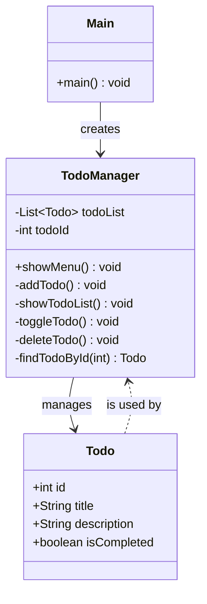

# 코틀린 콘솔 Todo 애플리케이션
## 프로젝트 소개
이 프로젝트는 코틀린을 학습하기 위한 콘솔 기반 Todo 애플리케이션입니다. 사용자는 터미널 인터페이스를 통해 할 일을 추가, 조회, 수정, 삭제할 수 있습니다.

["아토믹 코틀린"](https://www.aladin.co.kr/shop/wproduct.aspx?itemid=312687975) 책의 내용을 실제로 적용해보며 학습할 수 있도록 했습니다.

## 프로젝트 배경
코틀린 학습을 시작할 때 방대한 개념을 모두 학습하는 것보다는 실제 애플리케이션을 만들어 가며 필요한 개념을 학습하는 것이 효율적이라 생각했습니다.
["아토믹 코틀린"](https://www.aladin.co.kr/shop/wproduct.aspx?itemid=312687975) 책은 각 개념(아톰)이 독립적으로 구성되어 있어, 필요한 부분만 선택적으로 학습할 수 있었습니다.

이 Todo 앱은:
- 기본적인 CRUD(Create, Read, Update, Delete) 기능을 구현
- 책에서 특히 중요한 아톰들(변수, 함수, 클래스, 컬렉션 등)을 실습

## Todo 앱 개발에 필요한 '아토믹 코틀린' 필수 목차
> [링크]()가 있는 목차는 책을 읽다가 이해가 안됐거나 보충 설명이 필요한 것들을 정리한 문서로 연결됩니다. 

아토믹 코틀린 책에서 Todo 애플리케이션을 만들기 위해 반드시 학습해야 할 부분:
### 1부: 프로그래밍 기초 (필수)
- [x] 03 Hello, World! - 기본 프로그램 구조
- [x] var와 val - 변수 선언 방법
- [x] 데이터 타입 - 기본 데이터 타입
- [x] 함수 - 함수 정의와 호출
- [x] if 식 - 조건문
- [x] while로 반복하기 - 기본 반복문
- [x] 루프와 범위 - for 루프
- [x] in 키워드 - 컬렉션 다루기
### 2부: 객체 소개 (필수)
- [x] 17 클래스 만들기 - Todo 클래스 정의 
- [x] 18 프로퍼티 - 클래스 내 데이터 관리 
- [x] 19 생성자 - 객체 생성 
- [x] 20 가시성 제한하기 - 캡슐화 
- [x] [24 리스트 - Todo 항목 저장](docs/28_프로퍼티%20접근자-getter-setter.md)
- [x] 27 맵 - 데이터 구조화
- [x] 28 프로퍼티 접근자 - getter setter
### 3부: 사용성 (중요)
- [x] 31 이름 붙은 인자와 디폴트 인자 - 편리한 함수 호출
- [x] 33 when 식 - 메뉴 처리
- [x] 35 데이터 클래스 - Todo 클래스를 더 간결하게 
- [x] 37~40 널이 될 수 있는 타입 관련 - 안전한 코드 작성 
### 4부: 함수형 프로그래밍 (유용)
- [x] 44 람다 - 간결한 코드 작성
- [x] 46 컬렉션에 대한 연산 - Todo 리스트 필터링, 정렬
### 5부: 객체 지향 프로그래밍 (선택적)
- [ ] 55 인터페이스 - 확장 가능한 설계
- [ ] 63 합성 - 객체 조합
### 6부: 실패 방지하기 (중요)
- [ ] 73 예외 처리 - 오류 상황 관리
- [ ] 76 자원 해제 - 파일 저장/로드

# 코틀린 소개 및 Todo 앱을 통한 핵심 개념 설명 가이드
## 코틀린 소개
처음에는 '더 나은 자바'가 되려는 의도에서 탄생했다. 코틀린은 다른 언어에서 가장 성공적이고 개발자에게 도움이 되는 기능만을 실용적으로 채택했다. 2011년에 출시되고 2016년에 1.0버전이 나온 비교적 새로운 JVM 기반 언어이다.


## 코틀린과 자바
코틀린은 자바와 100% 상호 운용되면서도, 더 간결한 문법과 안정한 코드를 작성할 수 있게 해준다. 코틀린과 자바의 상호 운용성은 양방향으로 가능하다.
### 예시:
#### 자바 클래스를 코틀린에서 사용하기
```kotlin
// 코틀린 코드
import java.util.ArrayList // 자바 클래스 임포트

fun main() {
    // 자바 ArrayList 사용
    val javaList = ArrayList<String>()
    javaList.add("Hello")
    javaList.add("from")
    javaList.add("Kotlin")
    
    println(javaList.joinToString(" ")) // "Hello from Kotlin" 출력
}
```
#### 코틀린 클래스를 자바에서 사용하기
```kotlin
// Person.kt (코틀린 파일)
class Person(val name: String, val age: Int) {
    fun greet() = "Hello, my name is $name"
}
```

```java
// Main.java (자바 파일)
public class Main {
    public static void main(String[] args) {
        // 코틀린 클래스 사용
        Person person = new Person("John", 30);
        System.out.println(person.greet());
        
        System.out.println("Age: " + person.getAge()); 
        // 코틀린의 프로퍼티는 자바에서 getter로 접근
    }
}
```

코틀린 컴파일러는 JVM 바이트코드를 생성하기 때문에, 이런 상호 운용성이 가능하다. 프로젝트 내에서  두언어를 혼합해서 사용할 수 있다.

## Todo 앱 구조 소개



1. **`Main` 클래스**: 애플리케이션의 진입점으로, `TodoManager` 인스턴스를 생성하고 시작한다.
2. **`Todo` 데이터 클래스**: 할 일 항목을 나타내는 모델 클래스로, `id`, `title`, `description`, `isCompleted` 프로퍼티를 가진다.
3. **`TodoManager` 클래스**: 할 일 목록을 관리하고 사용자 인터페이스를 제공하는 핵심 클래스. 여러 기능을 위한 함수(메서드)들을 포함한다.

TodoManager에서 Todo 객체의 목록을 관리하고, Main에서 TodoManager를 생성하여 앱을 시작하는 단순한 구조입니다.
## 코틀린 설명
### 데이터 클래스 (Todo.kt)
```kotlin
data class Todo(
    val id: Int,
    var title: String,
    var description: String = "",
    var isCompleted: Boolean = false
)
```

`data class`는 데이터를 보관하는 목적의 클래스를 간결하게 만들 수 있게 해준다.
위의 예시 처럼 `data` 라는 키워드를 사용한다.

데이터 클래스에대한 자세한 설명은 [35 데이터 클래스](docs/35_데이터-클래스.md)에서 확인

#### 프로퍼티를 선언할 때 `val`과 `var`의 차이는?:
- **`val`**: 불변(immutable) 변수로, 자바의 final 변수와 유사하다.
- **`var`**: 가변(mutable) 변수로, 값을 변경할 수 있다.

**📕 아토믹 코틀린 참고:**
- 04 var와 val
- 35 데이터 클래스
- 18 프로퍼티
- 19 생성자

### 클래스와 함수 (TodoManager.kt)
```kotlin
class TodoManager {
	// ...
	fun showMenu() {//...}

	private fun addTodo() {//...}
	
}
```

클래스 본문 안에 정의된 함수`showMenu()`,`addTodo()` 는 해당 클래스(TodoManager)에 속한다. 코틀린에서는 이런 함수를 클래스의 **멤버 함수**라고 부른다. 자바와 같은 객체 지향 언어에서는 멤버 함수를 **메서드(method)** 라고 부르기도 한다.

그러나 코틀린 설계자들은 메서드라는 용어를 채택하지 않고, 대신 **함수라는 표현**을 언어 전반에서 계속 사용한다.
- **멤버 함수**: 클래스에 속한 함수
- **최상위(top-level) 함수**: 클래스에 속하지 않은 함수

**📕 아토믹 코틀린 참고:**
- 17 클래스 만들기

### println()과 print() (TodoManager.kt)
```kotlin
fun showMenu() {  
    while(true) {  
        println("\n==== Todo 관리 시스템 ====")  
        println("1. 할 일 추가")  
        println("2. 할 일 목록 보기")  
        println("3. 할 일 완료/미완료 토글")  
        println("4. 할 일 삭제")  
        println("0. 종료")  
        print("원하는 작업을 선택하세요: ")  
  
    }  
}
```

`println()`은 파라미터를 하나만 받는데 오직 String 타입만 받을 수 있다.
- `println()`: 파라미터를 화면에 출력한 후 커서를 다음 줄 맨 앞으로 옮긴다. 따라서 이후 화면에 출력한 내용은 다음 줄에 나타난다. 출력 후 줄바꿈을 자동으로 추가한다.
- `print()`: 파라미터로 전달받은 문자열과 같은 줄(출력한 내용 직후)에 커서를 남겨둔다. 출력 후 줄바꿈을 하지 않는다.

**📕 아토믹 코틀린 참고:**
- 03 Hello World!

### 패키지와 함수 (Main.kt)
```kotlin
fun main() {
    println("Todo 애플리케이션 만들기")
    val todoManager = TodoManager()
    todoManager.showMenu()
}
```

코틀린에서는 클래스 밖에도 함수를 선언할 수 있다. 위 코드의 `main()`함수가 예시.
자바 처럼 `public static void main`이라고 길게 쓸 필요가 없다.

참고: [자바와 코틀린의 함수 선언](docs/자바와-코틀린의-함수-선언.md)

#### 타입 추론
`val todoManager = TodoManager()`에서는 타입 추론 기능을 확인 가능. 변수 타입을 명식적으로 선언하지 않아도 컴파일러가 자동으로 추론한다.

**📕 아토믹 코틀린 참고:**
- 03 Hello, World!
- 06 함수
- 05 데이터 타입

### 컬렉션과 가변성 (TodoManager.kt)
```kotlin
private val todoList = mutableListOf<Todo>()
```

코틀린에서는 불변 컬렉션과 가변 컬렉션을 명확히 구분한다.
- **`listOf()`**: 불변 리스트 생성 (요소 추가/삭제 불가)
- **`mutableListOf()`**: 가변 리스트 생성 (요소 추가/삭제 가능)

`val todoList`에서 `val`은 참조가 변경되지 않음을 의미하고, 컬렉션 `mutable` 이기 때문에 컬렉션의 내용은 변경이 가능하다. 즉,
- `todoList = 다른리스트`는 불가능하지만
- `todoList.add(item)`은 가능하다.

```kotlin
fun getList(): List<Int> {
	 return mutableListOf(1, 2, 3)
}

fun main() {
	// getList()는 읽기 전용 List를 만든다
	val list = getList()
	
	list += 3 // 이것은 오류를 발생시킨다

}
```


### 컬렉션과 가변성 (TodoManager.kt)

코틀린에서는 컬렉션의 가변성과 관련해 명확한 구분이 있습니다:

```kotlin
// 불변(읽기 전용) 컬렉션
val readOnlyList: List<Todo> = listOf()

// 가변 컬렉션
val mutableTodoList: MutableList<Todo> = mutableListOf()
```

#### List와 MutableList의 차이
코틀린의 컬렉션 인터페이스는 두 가지로 나뉩니다:
1. `List<T>`: 읽기 전용 인터페이스로, 원소 조회만 가능
2. `MutableList<T>`: `List<T>`를 상속하면서 추가로 원소 추가/삭제/변경 기능 제공

#### 가변성 상황별 예시
**안되는 경우 (컴파일 에러)**:
```kotlin
// 케이스 1: val 변수에 선언된 읽기 전용 리스트에 원소 추가 시도
val list = listOf(1, 2, 3)
list += 4  // 컴파일 에러: val 변수는 재할당 불가, List는 add 메소드 없음

// 케이스 2: 함수에서 반환 타입이 List<Int>인데 외부에서 수정 시도
fun getList(): List<Int> {
    return mutableListOf(1, 2, 3)  // 내부적으론 MutableList이지만 반환 타입은 List
}

val list = getList()
list.add(4)  // 컴파일 에러: List에는 add 메소드가 없음
```

**되는 경우**:
```kotlin
// 케이스 1: var 변수에 선언된 읽기 전용 리스트에 += 연산자 사용
var list = listOf(1, 2, 3)
list += 4  // 정상 작동: 새 리스트 생성 후 재할당

// 케이스 2: val 변수에 선언된 가변 리스트에 원소 추가
val mutableList = mutableListOf(1, 2, 3)
mutableList.add(4)  // 정상 작동: MutableList에는 add 메소드 있음

// 케이스 3: var 변수에 선언된 가변 리스트에 += 연산자 사용
var mutableList2 = mutableListOf(1, 2, 3)
mutableList2 += 4  // 정상 작동: MutableList의 add 메소드 호출
```

**되는 경우 케이스 1에 대한 설명:**
> '새 리스트 생성 후 재할당'이라는 말은 list는 처음 생성했던 리스트와 다른 리스트가 생성되는 것인지?

1. 처음에 `listOf(1, 2, 3)`으로 읽기 전용(불변) 리스트가 생성되고, 이 리스트의 참조가 `list` 변수에 저장
2. `list += 4` 연산이 수행될 때:
    - 원본 리스트는 불변(읽기 전용)이므로 직접 수정할 수 없음
    - 따라서 코틀린은 내부적으로 원본 리스트의 모든 요소와 새 요소 `4` 를 포함하는 새로운 리스트를 생성
    - 그런 다음 `list` 변수에 이 새 리스트의 참조를 재할당한다.
3. 이 시점에서 `list`는 이제 `[1, 2, 3, 4]` 를 포함하는 새로운 리스트 객체를 참조

요약하면, `list += 4`는 내부적으로는 다음과 같은 작업과 동일하다:
```kotlin
list += 4 // 새 리스트를 만들어 재할당
```
이것은 메모리와 성능 측면에서 `MutableList`의 `add` 메서드를 사용하는 것보다 덜 효율적일 수 있다.
큰 리스트나 자주 업데이트되는 리스트의 경우 `MutableList`를 사용하는 것이 더 효율적
##### 리스트의 참조가 변경되는 것을 확인해볼 수 있는 코드
```kotlin
fun main() {  
    // 불변 리스트 생성 (읽기 전용)  
    var immutableList = listOf(1, 2, 3)  
  
    // 원본 리스트의 참조 식별자 출력  
    println("원본 immutableList 내용: $immutableList")  
    println("원본 immutableList 참조 ID: ${System.identityHashCode(immutableList)}")  
  
    // += 연산자 사용 (새 리스트 생성 후 재할당)  
    immutableList += 4  
  
    // 연산 후 리스트의 참조 식별자 출력  
    println("\n+= 연산 후 immutableList 내용: $immutableList")  
    println("+= 연산 후 immutableList 참조 ID: ${System.identityHashCode(immutableList)}")  
  
    println("\n====== 가변 리스트 비교 ======")  
  
    // 가변 리스트 생성  
    val mutableList = mutableListOf(1, 2, 3)  
  
    // 원본 가변 리스트의 참조 식별자 출력  
    println("원본 mutableList 내용: $mutableList")  
    println("원본 mutableList 참조 ID: ${System.identityHashCode(mutableList)}")  
  
    // add 메서드 사용 (같은 객체 수정)  
    mutableList.add(4)  
  
    // 연산 후 가변 리스트의 참조 식별자 출력  
    println("\nadd() 후 mutableList 내용: $mutableList")  
    println("add() 후 mutableList 참조 ID: ${System.identityHashCode(mutableList)}")  
  
    // 가변 리스트에 += 연산자 사용 (add 메서드와 동일)  
    mutableList += 5  
  
    // += 연산 후 가변 리스트의 참조 식별자 출력  
    println("\n+= 연산 후 mutableList 내용: $mutableList")  
    println("+= 연산 후 mutableList 참조 ID: ${System.identityHashCode(mutableList)}")  
}
```


#### 주요 개념 정리
- `val`과 `var`는 **참조의 변경 가능성**을 결정합니다
- `List`와 `MutableList`는 **컬렉션 내용의 변경 가능성**을 결정합니다
- `+=` 연산자는 컬렉션 타입에 따라 다르게 동작합니다:
    - `MutableList`: 같은 객체의 내용을 변경 (add 호출)
    - `List`: 새로운 리스트 생성 후 재할당 (var일 때만 가능)

**📕 아토믹 코틀린 참고:**
- 24장 리스트 - 읽기 전용 List와 가변 MutableList의 차이
- 20장 가시성 제한하기 - 에일리어싱(참조 공유)과 관련 개념

### Null 안전성 (TodoManager.kt)
```kotlin
val id = readlnOrNull()?.toIntOrNull()
val todo = findTodoById(id) ?: return
```

- `?`: 타입 뒤에 붙여 null이 될 수 있음을 명시 (예: `data?`)
- `?.`: 안전 호출 연산자로, 왼쪽 객체가 null이면 전체 표현식이 null이 됨
- `?:`: 엘비스 연산자로, 왼쪽 표현식이 null이면 오른쪽 값을 사용
#### String과 String?
코틀린에서는 타입 이름 뒤에 `?`를 붙이면 완전히 다른 타입이 된다:
```kotlin
// null이 될 수 없는 타입
val nonNullable: String = "Hello" 
// nonNullable = null  // 컴파일 오류!

// null이 될 수 있는 타입
val nullable: String? = "Hello"
nullable = null  // 정상 작동
```

`String`과 `String?`는 서로 다른 타입으로 취급됩니다. null이 될 수 있는 타입은 null 값을 허용하지만, 
그 대신 [일반적인 메서드 직접 호출이 제한](docs/00_코틀린에서-null이-될-수-있는-타입의-두-가지-특징.md)된다.

#### Map과 Null 안전성
Map에서 값을 가져올 때 항상 null이 될 수 있는 타입이 반환된다:
```kotlin
val map = mapOf(0 to "yes", 1 to "no")
val first: String? = map[0]    // "yes"
val second: String? = map[2]   // null (키가 없음)
```

이는 Map의 기저 구현인 자바 코드가 존재하지 않는 키에 대해 null을 반환하기 때문

#### Null 안전성의 실용적인 예시
Todo 앱에서 볼 수 있는 실제 코드에서의 활용:
```kotlin
// 사용자 입력을 정수로 변환 (실패 시 null)
val id = readlnOrNull()?.toIntOrNull()

// id가 null이면 함수를 즉시 종료
val todo = findTodoById(id) ?: return
```

참고:
- [readlnOrNull()과 readLine()]()

**📕 아토믹 코틀린 참고:**
- 37 널이 될 수 있는 타입
- 38 안정한 호출과 엘비스 연산자
- 39 널 아님 단언

###  구조 분해 선언과 if 조건문, for-in 루프
```kotlin
for ((id, title, description, isCompleted) in todoList) {
    val status = if (isCompleted) "[완료]" else "[진행중]"
    println("$id: $status $title - $description")
}
```

#### 구조 분해 선언
객체의 여러 프로퍼티를 한 번에 변수로 분해할 수 있다. 이를 구조 분해 선언이라고 한다.
위 코드에서는 Todo 객체를 반복하면서 각 객체의 프로퍼티를 개별 변수로 분해하고 있다.

아래의 코드와 위의 코드의 결과는 동일하다.
```kotlin
for (todo in todoList) {
	val status = if (todo.isCompled) "[완료]" else "[진행중]"
	println("${todo.id}. $status ${todo.title} - ${todo.description}")
}
```

원래 프로퍼티 이름과 달라도 상관없다. 중요한 것은 순서.
`val (id, _, description, _) = todo` 사용하지 않는 값은 `_`로 표시 할 수 있다.

#### if 조건문
```kotlin
// 일반적인 if 문 사용
if (isCompleted) {
    println("완료된 작업입니다")
} else {
    println("진행 중인 작업입니다")
}

// 표현식으로 사용
val status = if (isCompleted) "[완료]" else "[진행중]"
```

코틀린에서 if는 표현식으로 사용된다. 즉, 값을 반환할 수 있다.

#### for-in 루프
```kotlin
// 컬렉션 순회
for (todo in todoList) {
    println(todo.title)
}

// 범위(Range) 순회
for (i in 1..5) {
    println(i)
}
```

#### while, do-while 루프
```kotlin
// while 루프
while (true) {
    // 메뉴 표시
    // 사용자 입력 처리
    if (shouldExit) break
}

// do-while 루프
do {
    val input = readlnOrNull()
    // 입력 처리
} while (input != "0")
```
조건이 참인 동안 반복

**📕 아토믹 코틀린 참고:**
- 07 if 식
- 11 wile
- 12 루프와 범위 (반복문 기본)
- 13 in 키워드 (컬렉션 순회)
- 36 구조 분해 선언

### 람다와 고차 함수 (TodoManager.kt)
```kotlin
val todo = todoList.find { it.id == id }
```
코틀린은 함수형 프로그래밍을 지원한다. `find`는 컬렉션에서 조건에 맞는 첫 번째 요소를 찾는 고차 함수이다. 중괄호 `{}` 둘러싸인 부분이 람다식이다.


**📕 아토믹 코틀린 참고:**
- 44 람다
- 45 람다의 중요성
- 46 컬렉션에 대한 연산
- 48 고차 함수

### When 표현식 (TodoManager.kt)
```kotlin
when (readlnOrNull()) {
    "1" -> addTodo()
    "2" -> showtodoList()
    "3" -> toggleTodo()
    "4" -> deleteTodo()
    "0" -> return
    else -> println("잘못된 입력입니다.")
}
```

코틀린의 `when`은 자바의 `swich`문을 대체한다. when은 표현식이기 때문에 값을 반환할 수도 있다.

**📕 아토믹 코틀린 참고:**
- 33 when 식
- 07 if 식
- 14장 식과 문(표현식과 구문의 차이)

### 문자열 템플릿 (TodoManager.kt)
```kotlin
println("$id: $status $title - $description")
```

문자열 안에 `$변수명` 형태로 변수를 쉽게 삽입할 수 있다. 복잡한 표현식은 `${표현식}` 형태로 사용할 수 있다.

**📕 아토믹 코틀린 참고:**
- 8 문자열 템플릿


